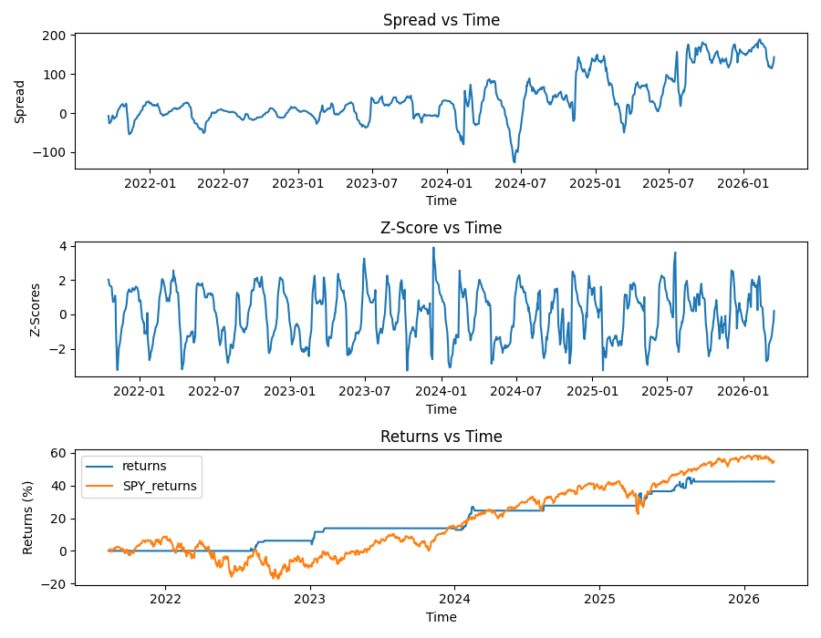

# Mean Reversion Pairs Backtester

This backtester identifies mean-reversion trading opportunities within equity pairs by using a rolling Augmented Dickney-Fuller test and obtaining trading signals when the rolling hedged spread significantly deviates from its mean.

## Performance Overview
The following results were generated using a 100-day rolling ADF window and a Z-score entry threshold of ±2.0.

| Pair | Sector | Sharpe Ratio | Annualized Returns| Max Drawdown |
| :--- | :--- | :--- | :--- | :---|
| **MU/NVDA** | Semiconductors | 1.29 | 9.25%| -5.34% |
| **BIIB/LLY** | Biotech | 0.93 | 5.26% | -3.79% |

## Top Performer: MU vs. NVDA


## Methodology
1. **Spread Formation:** The bot uses **Ordinary Least Squares** Regression over a set rolling window to find the optimal hedge ratio ($\beta$). I do this twice within the backtester for validation of a cointegrated relationship, and execution of trading signals. The formula I used for this is: 

    $$\text{Spread}_t = \text{Price}_{A,t} - (\beta \times \text{Price}_{B,t})$$

    Where $\beta$ represents the relationship between the two assets.

2. **Cointegration:** The backtester uses a **100-day** lookback window to create a spread on which it performs an **Augmented Dickey-Fuller test**, in turn generating a p-value for cointegration between the two stocks. Since the ADF test evaluates the **stationarity** of the pair, we are looking for low p-values, which indicate that the spread's mean and variance are stable over time. This is repeated for each day in the market to ensure that the relationship holds.

3. **Signal:** A second, shorter lookback window of **30 days** is used to calculate more recent $\beta$ values, creating a more responsive spread. A **rolling Z-score** is then calculated, using a lookback window of 20 days. This is calculated by subtracting the rolling mean ($\mu$) from the current spread and then dividing by the rolling standard deviation ($\sigma$): 

    $$Z = \frac{x - \mu}{\sigma}$$

4. **Position Generation:** The backtester has 2 main conditions for entry. Namely, the **p-value of the rolling ADF test must be < 0.1**, and the **correlation between the two stocks must be > 0.8**. If both conditions are met, the backtester then **shorts the spread whenever the Z-score is > 2**, and goes **long when the z-score is < -2**. It then maintains this position until the **z-score crosses 0**, as this maximizes profits from reversion.

5. **Exit Signals:** Outside of the z-score switching sign, the backtester will also choose to exit a trade if the **ADF p-value exceeds 0.15** or if the **correlation between the stocks falls below 0.5**, as these are indicators that the cointegration is weakening. Additionally, any **Z-score > |4|** will also cause the backtester to exit, as it is another indicator that the stocks are not cointegrated anymore. Finally, if the length of a trade exceeds **50 days**, the backtester will also stop trading, as the spread should have reverted to the mean within that time period.

6. **Returns Calculation:** The backtester calculates a percentage return by dividing our **daily PnL** from our hedged spread by the **capital required** to hold the spread. To ensure that no look-ahead bias is present, our daily PnL uses position and hedge ratio values from the **previous day**, combined with changes in stock prices from the **current day**. Additionally, every time we enter a new position that is different from the previous day, a cost of **-0.05%** is incurred in order to account for **commission costs** and **slippage**. Daily percentage changes are then summed up to create **cumulative returns**.

7. **Data Analysis:** The backtester then calculates multiple metrics, including a **sharpe ratio**, **annualized returns**, **max drawdown**, and **total trades**. Additionally, the backtester also utilises MatPlotLib to plot the **Z-scores**, **Spread**, and **Returns vs time**, along with a baseline comparison to **SPY Returns**.

## Benefits of the model
The model uses rigorous tests on past data to ensure that trades will have a high chance of success. This can be seen through the high sharpe ratio and low max drawdown in both pairs, offering a safer alternative to the SPY where trades will result in profits with reduced risk. Although it was outperformed, the MU and NVDA pair managed to produce **annualized returns of 9.25%**, which was only overshadowed due to a recent bull run in the market causing the SPY to rise quickly. However, **this strategy does well regardless of market conditions**, as one stock is always being shorted while the other one is being held long. This can be seen by the consistent returns with every trade, as the backtester manages to generate profits even when the market trends downwards.
## Weaknesses of the model
The main weakness of the model is the need to balance mathematical certainty with the need to actualize trades. Even within this model, an **ADF window of 100 days with p-values of 0.1** is not the most rigorous approach to pairs trading. However, putting further restrictions on the backtester only reduces its ability to trade, as it already trades very infrequently even for pairs that should be cointegrated. As such, **capital remains unused for most of the trading period**, as seen through the large periods where returns stay flat. Finally, the model moves very slowly, only trading on a **day-by-day basis**, relying on probabilities to create profits over trading speed.
## Future Steps
One simple improvement to the model would be to **combine it with another strategy**, so that the capital doesn't remain unused during periods where no valid signals are generated. For example, **trading a multi-pair portfolio** would allow for greater profits, as there would be far fewer periods where capital remains unused. As such, adding this functionality to the backtester is something that I am looking into for the future. Another option is **changing from daily trades to hourly trades**, as there would be far more opportunities for profits. However, it would also make trades much more risky, and weighing the benefits and drawbacks in order to manage risk is something that I have to consider if I implement this feature in the future.
## Installation
```bash
# Clone the repository
git clone https://github.com/urielkwok/Mean-Reversion-Pairs-Backtester
cd Mean-Reversion-Pairs-Backtester

# Install dependencies
pip install -r requirements.txt